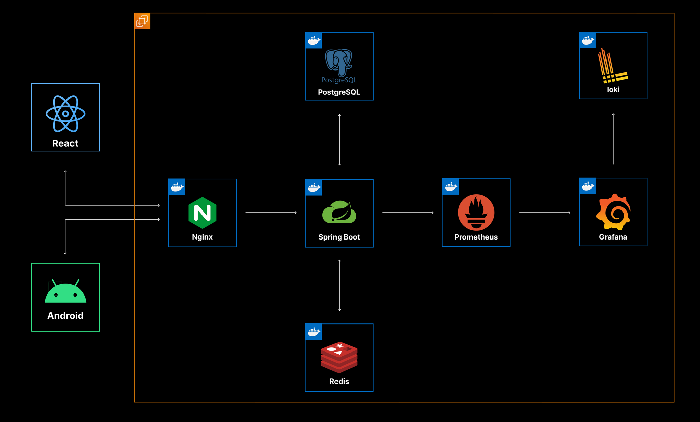

<h1>Glim(글:림)</h1>

## 📄 목차
- [📄 목차](#-목차)
- [✍🏻 프로젝트 개요](#✍🏻-프로젝트-개요)
- [🚀 핵심 기능](#🚀-핵심-기능)
- [⚙️ 기술 스택](#️-기술-스택)
- [🏛️ 시스템 아키텍처](#️-시스템-아키텍처)
- [🧡 팀원 소개](#-팀원-소개)
 

## ✍ 프로젝트 개요
`글귀 + 울림`, ‘글귀 + film’ 또는 ‘glimpse(흘낏보다)’의 조합. 
짧지만 깊은 인상을 남기는 글귀를 공유하며, 
숏츠(글림으로 명명) 폼으로 다른 사람들과 감성을 공유하며 
글림을 통해 책에 대한 관심을 유발하고,
알라딘 등 온라인 서점으로 연결하여 구매를 유도

### 기획의도
현대인의 디지털 과부하 문제
- 무분별한 숏폼 콘텐츠 소비 (틱톡, 인스타 릴스)
- 자극적이고 빠른 콘텐츠에 익숙해진 뇌
- 집중력 저하 및 깊이 있는 사고 부족
- 책 읽기 시간과 독서량 급격한 감소

글림의 디지털 디톡스 접근법
"완전한 차단이 아닌, 건전한 대안 제시"

### 서비스 소개
- 개발 기간: 25.07.07 ~ 25.08.18
- 인원: 6명
- 서비스 개요 : [도서 중개 웹/앱 플랫폼 서비스] 글:림, Glim
- **SSAFY 공통프로젝트 우수상 수상**

 

## 🚀 핵심 기능

| **1.1 글귀 입력(직접 입력/OCR)** | **1.2 글귀 기반** **AI 배경 이미지 생성** | **1.3 글귀 확인** |
|------|--------|------|
|  |  |  | 

| **2.1 글귀(글림), 도서,** **작가 검색** | **2.2 인기 글귀 조회** | **2.3 키워드/테마별** **큐레이션** |
|------|--------|------|
|  |  |  | 

| **3.1 글귀 저장** | **3.2 글림 이미지저장** |
|------|--------|
|  |  |

| **4.1 도서 상세 정보** | **4.2 관련 글귀 보기** |
|-----|------|
|   |  | 

| **5.1 마이페이지**| **5.2 잠금화면 글귀 설정** |
|------|------|
|  |  |

## ⚙️ 기술 스택
| **파트** | **기술 스택** |
|----------|---------------|
| **Android** | Kotlin 2.1.12, ComposeUI, MVI(Orbit), Hilt, MLKit(OCR), Datastore, Coroutine-Flow |
| **Backend** | Java 21, Spring Boot, Spring Data JPA, Spring Web (REST API), Spring Actuator, Flyway, OpenFeign, JWT, Mustache, Spring REST Docs, JaCoCo, JUnit 5, H2 Database |
| **Frontend** | React, Redux, TypeScript |

## 🏛️ 시스템 아키텍처

## 🧡 팀원 소개
다음은 요청하신 대로 **가로로 배열한 팀 멤버 표**입니다:

| [윤문정](https://github.com/yuuuuuu32) | [박성준](https://github.com/park99999) | [홍지표](https://github.com/devMuscle) | [오인성](https://github.com/ois0886) | [박승준](https://github.com/ootr47) | [윤준석](https://github.com/JunSeok-Yun) |
|:---:|:---:|:---:|:---:|:---:|:---:|
|  |  |  |  |  |  |
| 웹프론트 | **팀장** 안드로이드, 백엔드, 디자인 | 백엔드, 인프라 | 안드로이드, 디자인 | 안드로이드, 디자인 | 백엔드 |